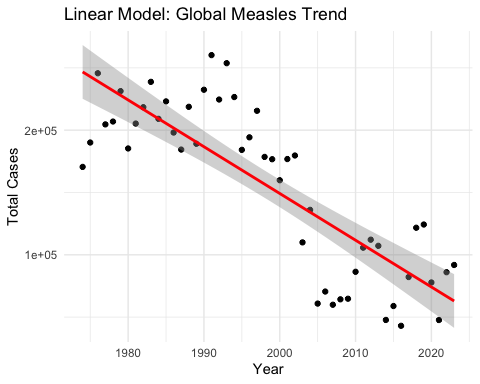
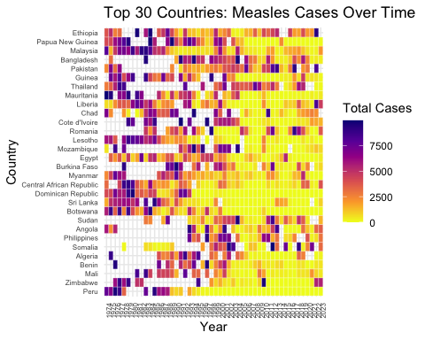

# 🌍 Global Measles Trends Analysis (1974–2023)

## 📊 Project Overview
This project analyses global measles trends using WHO surveillance data, applying advanced data science techniques to uncover patterns, evaluate interventions, and forecast future outbreaks.

## 🎯 Objectives
- Analyse global measles trends over 50 years
- Identify high-risk regions and outbreak severity
- Build predictive models for future case estimation

## 🧠 Methods & Techniques
- Data Cleaning & Feature Engineering (R, tidyverse)
- Exploratory Data Analysis (EDA)
- Linear Regression (R² ≈ 0.67)
- Machine Learning:
  - Random Forest (Accuracy: 81.5%)
  - XGBoost (High accuracy, potential overfitting)

## 📈 Key Insights
- Global measles cases show a **significant long-term decline**
- Africa and Eastern Mediterranean regions remain high-risk
- Post-2000 vaccination campaigns significantly reduced cases
- Predictive modelling suggests continued decline with uncertainty

## 📁 Project Structure

## 📊 Results

- Linear regression shows a **significant decline** in global measles cases (R² ≈ 0.67)
- Random Forest achieved **81.5% accuracy** in identifying high-risk cases
- XGBoost achieved **100% accuracy** (potential overfitting identified)
- Africa accounts for the **highest global measles burden (>2M cases)**
## 📈 Global Measles Trend

## 🌍 Top 30 Countries Heatmap

